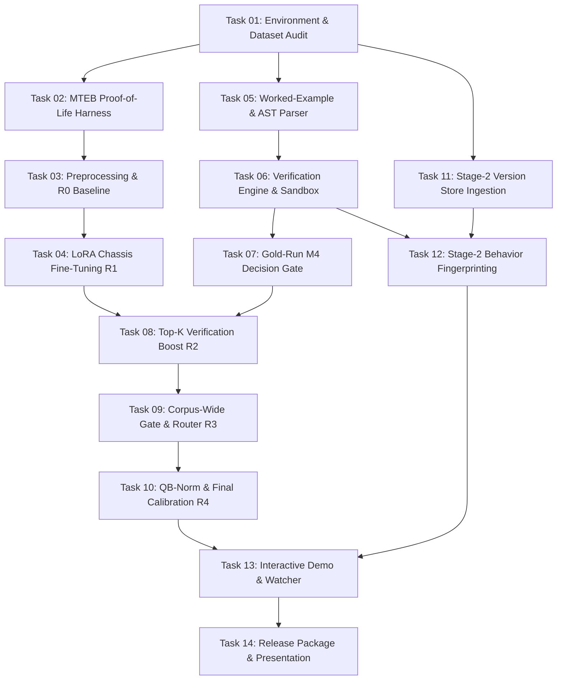

# TASKS.md — VERA Complete Implementation Master Plan
**VERA (Verify-first Retrieval Architecture)**  
*Samsung PRISM GenAI Hackathon · Theme 1: Agentic Code Intelligence (CoIR APPS)*

---

## 1. Executive Summary & Architecture Overview

VERA solves competitive code retrieval by combining dense semantic search with dynamic program verification. Instead of relying solely on text similarity, VERA exploits the fact that APPS problem statements contain worked input/output examples. By parsing these examples into executable test harnesses, VERA executes candidate solutions in an isolated, high-speed sandbox and applies a rarity-weighted boost to verified candidates.

```
       [ Query: Problem Statement ]
                    │
      ┌─────────────┴─────────────┐
      ▼                           ▼
[ L1 Chassis ]             [ Worked Examples ]
Dense Retrieval (8192 ctx)   AST Parser + Test Generator
Top-150 Candidates                │
      │                           ▼
      └─────────────┬─────────────┘
                    ▼
          [ L2 Verification ]
          Dual Harness (Script / Call)
          Normalized Comparator + Forkserver Pool
                    │
                    ▼
          [ Rarity Boost & Gate ]
          Confidence = (pass/total) · 1/(1 + log₂(m))
          Uncertainty Routing + QB-Norm Demotion
                    │
                    ▼
       [ Ranked Solutions / Submissions ]
                    │
       (Stage-2: P1 Version Store & Behavior Index)
```

### The 5 Submission Artifacts (Target Definition of Fully Built)
1. **`appsretrieval_results.json`**: Official MTEB `TaskResult` JSON on the test split from the highest winning rung.
2. **Reproducible `README.md`**: CPU-only reproduction commands, pinned environment lock, and stated execution runtime.
3. **Tagged GitHub Release**: Clean Git tag with the final evaluation JSON attached as a release artifact.
4. **Presentation Deck (PPT)**: 10 slides strictly formatted to M11 specifications (ablation table verbatim, architecture, benchmark findings).
5. **Demo Video & Hands-on Surface**: Recorded walkthrough and live Gradio application demonstrating query retrieval, badges, and version diffing.

---

## 2. Ship Ladder & Non-Negotiable Rules

### Ship Ladder (Guaranteed Submittability)
| Rung | Architecture Description | Expected Metric / Target | Status |
|---|---|---|---|
| **R0** | `gte-modernbert-base` (8192 context) + boilerplate-stripped corpus | NDCG@10 $\ge 0.575$ (beat baseline) | Guaranteed Floor |
| **R1** | R0 + LoRA contrastive fine-tuning on 4.5K train pairs + int8 ONNX | NDCG@10 $0.65\text{--}0.75$ | Core Model Chassis |
| **R2** | R1 + Top-K verification ($K=150$) with rarity-weighted boost ($\alpha$) | $+3\text{--}8$ NDCG boost | **Guaranteed Fallback Ship** |
| **R3** | R2 + corpus-wide verification behind static AST signature gate | Dev-measured net positive vs R2 | Conditional on M4 Gate ($\ge 60\%$) |
| **R4** | R3/R2 + QB-Norm demotion + calibrated ensemble blending | Final optimized submission | **Competition Winner** |

### Hard Constraints
1. **Zero Metadata Leakage**: Never score using document IDs, partition tags, or dataset ordering. The $qN \leftrightarrow dN$ alignment is documented in `docs/dataset-audit.md` and strictly quarantined.
2. **Dev Split Discipline**: All tuning, thresholding, and $\alpha$-fitting are done exclusively on the fixed 500-pair **dev split**. The test split is touched only at milestone JSON exports.
3. **CPU Reproducibility**: Final inference must run entirely on CPU without external network access and match the stated runtime on a clean clone.
4. **Bounded Boost Only**: Verification is an additive calibrated boost ($\text{norm}(S_{dense}) + \alpha \cdot \text{conf}$); it must never hard-filter or catastrophically reorder strong dense predictions.

---

## 3. Master Task Breakdown (14 Sequential Tasks)



---

### Task 01: Environment Pinning, Repository Setup, and Dataset Audit
- **Track & Milestone**: Main Track M1 · External E1
- **Target Module**: `vera/data/`, `docs/`, `requirements.lock`
- **Objective**: Establish the isolated workspace, pin dependencies for CPU reproduction, load APPS dataset splits via MTEB, audit potential leakage vectors, and dispatch SPOC legal queries.

#### Detailed Steps
1. Create the repository directory structure:
   ```
   vera/
     data/        chassis/     verify/      gate/
     stage2/      mtebio/      demo/        eval/
     docs/        scripts/     tests/
   ```
2. Pin all dependencies in `requirements.lock` (Python 3.11, `mteb>=2.0`, `sentence-transformers`, `torch` CPU wheels, `onnxruntime`, `datasets`, `peft`, `gradio`).
3. Implement `vera/data/loader.py`:
   - Load `AppsRetrieval` via `mteb.get_task("AppsRetrieval")`.
   - Verify counts: exactly 3,765 test queries, 8,765 corpus documents, 1 binary gold document per query.
   - Join the 5,000 train-partition solutions with problem statements from `codeparrot/apps`.
   - Create deterministic, fixed-seed 4,500 train / 500 dev split and commit indices to `vera/data/dev_split_ids.json`.
4. Run leakage audit script `scripts/m1_audit.py`:
   - Document $qN \leftrightarrow dN$ index alignment and partition tags.
   - Quarantine metadata fields from model ingestion.
   - Inventory `meta_information` (starter code availability, source URLs).
   - Re-measure the worked-example parseable rate across test queries (~78% baseline).
5. Send Day 1 SPOC inquiry clarifying pipeline legality (`SearchProtocol` dynamic verification vs `AbsEncoder` text-only) and screening deadlines.

- **Exit Artifacts**:
  - `docs/dataset-audit.md` (Committed audit report)
  - `requirements.lock`
  - `vera/data/loader.py` & `vera/data/dev_split_ids.json`

---

### Task 02: MTEB Submission Harness Proof-of-Life & Dual Interface
- **Track & Milestone**: Main Track M2 · Architecture Spec 7.6
- **Target Module**: `vera/mtebio/`, `scripts/m2_harness_test.py`
- **Objective**: Build the submission interface and produce a valid `TaskResult` JSON before complex logic is built. De-risk submission mechanics on Day 1.

#### Detailed Steps
1. Implement `vera/mtebio/search_protocol.py`:
   - Create class `VERASearchProtocol` implementing MTEB v2 `SearchProtocol`.
   - Implement `index(corpus)` to ingest and cache document embeddings.
   - Implement `search(queries, top_k)` returning nested dictionary `dict[str, dict[str, float]]`.
2. Implement `vera/mtebio/encoder_fallback.py`:
   - Create fallback subclass `VERAAbsEncoder(AbsEncoder)` for pure embedding fallback.
3. Address known MTEB serialization quirks:
   - Provide `ModelMeta` with mock `memory_usage_mb` and loader strings.
   - Wrap JSON output encoder with `default=str` to handle ISO datetime serialization.
4. Execute `scripts/m2_harness_test.py` using a lightweight stub to generate a full `appsretrieval_results.json`.
5. Validate the resulting JSON against the official MTEB benchmark schema.

- **Exit Artifacts**:
  - `vera/mtebio/` package (Dual interface)
  - `scripts/m2_harness_test.py`
  - Validated throwaway `artifacts/m2_proof_of_life.json`

---

### Task 03: Chassis Preprocessing & R0 Baseline Reproduction
- **Track & Milestone**: Main Track M3 · Rung R0
- **Target Module**: `vera/chassis/preprocess.py`, `scripts/m3_baseline.py`
- **Objective**: Establish the unassisted retrieval floor by evaluating zero-shot `gte-modernbert-base` with full 8192 context on boilerplate-stripped corpus documents.

#### Detailed Steps
1. Build `vera/chassis/preprocess.py`:
   - Implement corpus boilerplate stripper: remove fast-IO preambles (`sys.stdin.readline` rebinding), recursion limit adjustments (`sys.setrecursionlimit`), threading imports, and duplicated competitive programming contest templates.
   - Retain two corpus representations: `stripped` for dense encoding and `raw` for verification execution.
2. Build 8192-token context query encoder:
   - Load `Alibaba-NLP/gte-modernbert-base`.
   - Prevent 1024-token truncation so tail problem sections (containing worked examples and constraints) are fully embedded.
3. Implement dense retrieval scoring:
   - Compute corpus embeddings in batches and cache to disk (`corpus_embeddings.npy`).
   - Run brute-force matrix multiplication on CPU (8,765 docs fit easily in RAM without FAISS overhead).
4. Run `scripts/m3_baseline.py` to evaluate on the test split through `mteb.evaluate`.

- **Acceptance Threshold**: Test NDCG@10 $\ge 0.575$ (reproduce or surpass published baseline).
- **Exit Artifacts**:
  - `vera/chassis/preprocess.py`
  - `scripts/m3_baseline.py`
  - `artifacts/m3_r0_results.json` (Milestone JSON #1)

---

### Task 04: LoRA Contrastive Fine-Tuning & ONNX CPU Export (R1)
- **Track & Milestone**: Main Track M5 · Rung R1
- **Target Module**: `vera/chassis/fine_tune.py`, `vera/chassis/export_onnx.py`
- **Objective**: Fine-tune the encoder using domain-specific hard negatives and export to int8 ONNX for high-throughput CPU inference.

#### Detailed Steps
1. Build hard negative mining in `vera/chassis/mine_negatives.py`:
   - For each of the 4,500 training queries, mine top-20 dense non-gold solutions from the base model.
   - Group queries by near-duplicate problem statement clusters and add cross-problem solutions as adversarial hard negatives.
2. Build Colab/GPU fine-tuning script `scripts/train_lora.py`:
   - Target encoder with LoRA ($r=16, \alpha=32$, dropout=0.05).
   - Loss function: `MultipleNegativesRankingLoss`.
   - Hyperparameters: batch size 32–64, learning rate $1\times 10^{-4}$ (LoRA adapter) and $2\times 10^{-5}$ (projection head), 3–5 epochs.
   - Evaluate dev-split NDCG@10 after each epoch and checkpoint the best weights.
3. Execute bake-off on dev split:
   - Compare `gte-modernbert-base` (fine-tuned) against `Qwen3-Embedding-0.6B` and `jina-code-embeddings-0.5b` (int8).
4. Merge LoRA weights and export the winning model to ONNX int8 (`vera/chassis/export_onnx.py`).
5. Update embedding cache keyed by `(model_hash, preproc_hash)`.
6. Run `scripts/m5_eval_r1.py` on test split.

- **Acceptance Threshold**: Dev NDCG@10 shows clear positive delta over R0 (target $0.65\text{--}0.75$).
- **Exit Artifacts**:
  - Fine-tuned ONNX int8 model weights (`models/vera_chassis_int8.onnx`)
  - `vera/chassis/fine_tune.py` & `export_onnx.py`
  - `artifacts/m5_r1_results.json` (Milestone JSON #2)

---

### Task 05: Worked-Example Parser & Static AST Signature Analyzer
- **Track & Milestone**: Main Track M6 · Verification Spec 7.3 & 7.4
- **Target Module**: `vera/verify/parser.py`, `vera/gate/signature.py`
- **Objective**: Extract structured test fixtures from natural language statements and extract AST input signatures from candidate programs.

#### Detailed Steps
1. Implement `vera/verify/parser.py`:
   - Parse section titles: `Example`, `Sample Input/Output`, `Examples`, markdown code blocks, and indented text.
   - Extract pairs: `[(stdin_text, expected_stdout), ...]`.
   - Normalize escaped characters, whitespace, and multi-line sequences.
   - Record and log parse-failure categories (no examples found, malformed blocks, image-only diagrams).
2. Implement `vera/gate/signature.py`:
   - Static AST parsing of candidate Python programs.
   - Classify I/O signature shapes:
     - `single-line`: Single `input()` or `sys.stdin.readline()`.
     - `n-then-n-lines`: Loop bounded by initial integer reading.
     - `token-line`: Space-separated tokens via `.split()`.
     - `multi-case-t`: Outer testcase loop `for _ in range(int(input()))`.
     - `unknown`: Complex or unparseable dynamic I/O.
   - Detect functional entrypoints (`def solve(...)`, `class Solution:`) vs pure stdin scripts.
3. Write test suite in `tests/test_parser_and_gate.py` across 100 representative APPS problem statements.

- **Acceptance Threshold**: Example extraction success rate $\ge 75\%$ on the test set; signature classification coverage $\ge 80\%$.
- **Exit Artifacts**:
  - `vera/verify/parser.py`
  - `vera/gate/signature.py`
  - `tests/test_parser_and_gate.py` (Passing unit tests)

---

### Task 06: Verification Engine Sandbox & Normalized Output Comparator
- **Track & Milestone**: Main Track M6 · Core Engine Spec 7.3
- **Target Module**: `vera/verify/executor.py`, `vera/verify/comparator.py`
- **Objective**: Build a high-throughput, secure, isolated execution sandbox with normalized output comparison and adaptive timeouts.

#### Detailed Steps
1. Build `vera/verify/comparator.py`:
   - Token-wise comparison on whitespace-split outputs.
   - Floating-point tolerance: $|a - b| \le 10^{-6} \cdot \max(1.0, |b|)$ when both tokens parse as floats.
   - Trailing newline and whitespace insensitivity.
   - Multi-line set/order comparison fallback when problem statement specifies "in any order".
2. Build `vera/verify/executor.py`:
   - `multiprocessing` pre-warmed forkserver pool (`workers = os.cpu_count()`).
   - Sub-process dispatch overhead target $\le 10$ ms.
   - Sandboxing: disable network sockets, chdir to temporary scratch directories, cap max memory via `resource.setrlimit(RLIMIT_AS, ...)`.
   - Dual execution harness:
     - **Mode A (Script)**: Pipe stdin through process stdin buffer.
     - **Mode B (Call)**: AST-instantiate `Solution().method(*args)` or `solve(*args)` with parsed arguments.
     - Candidate passes if either harness matches.
3. Implement adaptive timeout policy:
   - Default timeout: 0.75 seconds.
   - Adaptive demotion: If a snippet times out $\ge 2$ times across queries, drop timeout to 0.30s; if $\ge 4$ times, skip snippet and record failure.

- **Acceptance Threshold**: Verification engine unit tests execute 500 test runs in $<5$ seconds on CPU without memory leaks or zombie processes.
- **Exit Artifacts**:
  - `vera/verify/executor.py`
  - `vera/verify/comparator.py`
  - `verify/` test suite passing green (`tests/test_executor.py`)

---

### Task 07: Gold-Run Measurement & M4 Go/No-Go Decision Gate
- **Track & Milestone**: Main Track M4 · Decision Gate
- **Target Module**: `scripts/m4_goldrun.py`, `docs/goldrun.md`
- **Objective**: Execute gold solutions on their own worked examples to measure the empirical ceiling of verification and formally determine whether corpus-wide verification is viable.

#### Detailed Steps
1. Implement `scripts/m4_goldrun.py`:
   - Take the 300 sampled train pairs from M1.
   - Run raw gold programs on the parsed worked examples using baseline execution.
   - Run gold programs through the dual harness with normalized comparator.
   - Compute pass percentages before and after harness fixes.
2. Diagnose failure modes:
   - Identify formatting discrepancies (e.g. float formatting, multi-testcase headers, unhandled prompts).
   - Refine comparator tolerance and parser rules where appropriate.
3. Apply the formal M4 Gate Policy:
   - **Case $\ge 60\%$**: Corpus-wide track (Task 09 / M8) is unlocked.
   - **Case $40\%\text{--}60\%$**: Restrict verification strictly to Top-K candidates ($K=150$, skip Task 09).
   - **Case $< 40\%$**: Demote verification to cautious small additive boost; R2 becomes the hard ceiling.
4. Document the measured rate, error breakdown, and selected operational branch in `docs/goldrun.md`.

- **Exit Artifacts**:
  - `docs/goldrun.md` (Gate decision log and metrics)
  - `scripts/m4_goldrun.py`

---

### Task 08: Top-K Verification Re-Ranking & Calibrated Rarity Boost (R2)
- **Track & Milestone**: Main Track M7 · Rung R2 (Guaranteed Fallback Ship)
- **Target Module**: `vera/verify/boost.py`, `scripts/m7_topk_verify.py`
- **Objective**: Combine dense candidates with verification execution over the top-150 results using rarity-weighted boost calibrated on the dev split.

#### Detailed Steps
1. Implement Rarity-Weighted Boost in `vera/verify/boost.py`:
   - For query $q$ with $E$ extracted examples, run candidate $d \in \text{Top-150}$.
   - Let $e_{pass}$ be the number of matched examples ($0 \le e_{pass} \le E$).
   - Let $m$ be the total number of candidate solutions in Top-150 that produced this identical output on example 1.
   - Compute confidence:
     $$\text{conf}(d, q) = \left(\frac{e_{pass}}{E}\right) \cdot \frac{1}{1 + \log_2(m)}$$
   - Cap $\text{conf}(d, q) \in [0.0, 1.0]$.
2. Compute combined ranking score:
   $$S_{final}(d, q) = \text{norm}(S_{dense}(d, q)) + \alpha \cdot \text{conf}(d, q)$$
   where dense scores are min-max normalized across the candidate pool.
3. Fit $\alpha$ on the 500-pair dev split via grid search ($\alpha \in [0.05, 0.40]$) to maximize NDCG@10.
4. Execute `scripts/m7_topk_verify.py` across the test set and emit MTEB JSON.

- **Acceptance Threshold**: Dev NDCG@10 delta positive vs M5 (+3 to +8 points expected); test JSON valid.
- **Exit Artifacts**:
  - `vera/verify/boost.py`
  - `scripts/m7_topk_verify.py`
  - `artifacts/m7_r2_results.json` (Milestone JSON #3 — Guaranteed Fallback)

---

### Task 09: Corpus-Wide Verification, Gate Filtering & Uncertainty Router (R3)
- **Track & Milestone**: Main Track M8 · Rung R3 (Conditional on M4)
- **Target Module**: `vera/gate/router.py`, `scripts/m8_corpus_gate.py`
- **Objective**: Extend verification beyond Top-K across all 8,765 documents for high-uncertainty queries, guarded by signature matching and strict runtime budgets.

#### Detailed Steps
1. Condition Check: Proceed only if Task 07 measured M4 pass rate $\ge 60\%$. If not, log skipping to `docs/ablations.md` and carry R2 forward.
2. Implement Uncertainty Router in `vera/gate/router.py`:
   - Compute dense top-2 score margin: $\Delta_{1,2} = S_{dense}^{(1)} - S_{dense}^{(2)}$.
   - If $\Delta_{1,2} \ge \tau_{margin}$ (dev-fit threshold), the dense prediction is decisive $\rightarrow$ skip corpus verification to conserve runtime.
3. Implement Signature Layout Gate:
   - For remaining ambiguous queries, check if the query signature matches the candidate AST signature.
   - Exclude candidates classified as `unknown` or mismatching signatures.
4. Runtime Budget Sanity Check:
   - Calculate projected CPU execution time: $\sum (\text{candidates} \times \text{run\_ms} + \text{timeout\_tail})$.
   - Verify total runtime fits within the overnight CPU window ($< 8$ hours). Tighten $\tau_{margin}$ if projected runtime exceeds limits.
5. Evaluate on dev split per difficulty tier. Retain only tiers where net NDCG improves.
6. Run `scripts/m8_corpus_gate.py` on test split.

- **Acceptance Threshold**: Dev NDCG@10 improves over R2. (If neutral or negative, document the measured rejection in `docs/ablations.md`).
- **Exit Artifacts**:
  - `vera/gate/router.py`
  - `scripts/m8_corpus_gate.py`
  - `artifacts/m8_r3_results.json` (or formal documented rejection report)

---

### Task 10: QB-Norm Content Demotion, Ensemble Blending & Full Ablation (R4)
- **Track & Milestone**: Main Track M9 · Rung R4 (Final Pipeline)
- **Target Module**: `vera/chassis/qbnorm.py`, `eval/ablation.py`
- **Objective**: Implement querybank score normalization to eliminate train-set bias without metadata leakage, optimize ensemble weights, and generate the complete benchmark ablation table.

#### Detailed Steps
1. Implement Querybank Normalization in `vera/chassis/qbnorm.py`:
   - Utilize the 5,000 public training problem statements as the querybank.
   - For any corpus document $d$, compute its average similarity to the querybank:
     $$\mu_{qb}(d) = \frac{1}{|QB|} \sum_{q_{tr} \in QB} \text{sim}(q_{tr}, d)$$
   - Demote candidates with disproportionately high training statement affinity:
     $$S_{qbnorm}(d, q) = S(d, q) - \beta \cdot \mu_{qb}(d)$$
   - Calibrate $\beta$ on dev split. Note: This achieves the benefits of train-partition demotion purely through semantic content without reading dataset tags.
2. Calibrate final ensemble blend on dev split:
   - Combine dense chassis (R1) + rarity verification (R2/R3) + QB-Norm (R4).
3. Implement `eval/ablation.py`:
   - Generate `docs/ablations.md` measuring all rungs (R0, R1, R2, R3, R4) and individual ablation components on NDCG@10, MRR@10, metric $\Delta$, and execution latency.
4. Run final test evaluation and export the official submission file `appsretrieval_results.json`.

- **Acceptance Threshold**: Every row in `docs/ablations.md` carries real measured data; final test JSON valid and complete.
- **Exit Artifacts**:
  - `vera/chassis/qbnorm.py`
  - `eval/ablation.py`
  - `docs/ablations.md` (Ablation table for PPT Slide 5)
  - `artifacts/final_appsretrieval_results.json` (Final Submission Rung R4)

---

### Task 11: Stage-2 Version Store & Multi-Source Ingestion (P1/Bonus)
- **Track & Milestone**: Side Track S1 · Stage-2 P1 Requirement
- **Target Module**: `vera/stage2/store.py`, `vera/stage2/ingest.py`
- **Objective**: Build an incremental code ingestion store using normalized AST hashing to eliminate redundant re-embedding across code revisions.

#### Detailed Steps
1. Implement Normalized AST Hashing in `vera/stage2/store.py`:
   - Strip comments, docstrings, variable formatting, and line numbers from candidate code using `ast`.
   - Generate snippet canonical ID: $\text{ID} = \text{SHA-256}(\text{dump\_ast}(code))$.
   - Reformatting, whitespace changes, or relocations retain identical hashes.
2. Build Multi-Source Ingestion in `vera/stage2/ingest.py`:
   - Support Git repositories: iterate commit trees and extract code blobs.
   - Support folder snapshots: scan directory trees and detect file modifications.
3. Build incremental embedding index:
   - When a new revision arrives, check snippet hashes against cache.
   - Only newly modified AST hashes trigger dense embedding.
4. Benchmark rebuild performance:
   - Measure synthetic commit ingestion time comparing full re-index vs incremental hash-cached index.

- **Acceptance Threshold**: Incremental rebuild achieves $>10\times$ speedup over full re-embedding on synthetic commits.
- **Exit Artifacts**:
  - `vera/stage2/store.py`
  - `vera/stage2/ingest.py`
  - `tests/test_stage2_store.py` (Passing unit tests)

---

### Task 12: Stage-2 Behavior Fingerprint Index, Diff-Line Ranker & Trace Matcher
- **Track & Milestone**: Side Track S2, S3 · P1 Differentiation
- **Target Module**: `vera/stage2/fingerprint.py`, `vera/stage2/ranker.py`
- **Objective**: Distinguish functional code behavior from textual changes: certify behaviorally unchanged revisions and out-rank buggy revisions when both pass worked examples.

#### Detailed Steps
1. Implement Behavior Fingerprinting in `vera/stage2/fingerprint.py`:
   - Construct deterministic probe batteries conditioned on the AST signature shape (e.g., standard boundary numbers, empty lists, extreme integers).
   - Execute candidates against probe inputs in sandbox.
   - Output fingerprint = $\text{SHA-256}(\text{stdout}_1 + \text{stdout}_2 + \dots)$.
   - Handle exceptions: format as deterministic tokens `CRASH:<ExceptionType>`.
   - If two versions share identical fingerprints, certify as `behaviorally unchanged` and bypass re-ranking.
2. Implement Diff-Line Ranker in `vera/stage2/ranker.py`:
   - Address the rival's conceded edge-case: two program versions both pass the basic worked example, but one contains a bug on edge cases.
   - Extract unified diff between versions $\rightarrow$ embed only added/modified lines.
   - Compute blended score: $S_{version} = 0.70 \cdot S_{global} + 0.30 \cdot S_{diff}$.
3. Implement Trace-Value Tie-Break Matcher:
   - For statements with $\ge 3$ literal numbers, use `sys.settrace` to record intermediate runtime variable values during the worked example run.
   - Compute Jaccard overlap between statement literals and trace literals as a secondary tie-break.
4. Build synthetic evaluation benchmark on ~200 problems:
   - Synthesize $v1 \rightarrow v2 \rightarrow v3$ histories with injected single-token bugs.
   - Measure working-version-first retrieval rate.

- **Acceptance Threshold**: Working-version-first rate $\ge 100\%/22$ parity with competitors; demonstrate measured wins on both-pass pairs.
- **Exit Artifacts**:
  - `vera/stage2/fingerprint.py`
  - `vera/stage2/ranker.py`
  - `scripts/s3_version_benchmark.py` & benchmark metric log

---

### Task 13: Interactive Demo Surface & Standing-Questions Live Watcher
- **Track & Milestone**: Side Track S4 · Main Track M12 · Spec 7.8
- **Target Module**: `vera/demo/app.py`, `scripts/run_demo.py`
- **Objective**: Create a polished Gradio web interface showcasing live query retrieval, verification badges, version lineage, and live event monitoring for presentation and evaluation.

#### Detailed Steps
1. Build Gradio UI in `vera/demo/app.py`:
   - **Query Panel**: Interactive problem statement input box with pre-loaded example queries.
   - **Results View**: Top ranked code snippets decorated with visual status badges:
     - `PASSED 2/2 Examples` (Green)
     - `FAILED` (Muted red)
     - `Fingerprint: #a3f9e...` (Blue monospace)
     - `Behaviorally Unchanged` (Purple pill)
     - Version lineage indicator: `v1 (buggy) ➔ v2 (fixed) ➔ v3 (refactored)`.
2. Implement Standing-Questions Live Watcher:
   - Register a suite of standing benchmark queries.
   - Provide an "Ingest New Commit / Snapshot" button.
   - Upon ingestion, watch index update in real time and display dynamic diff of query rankings.
3. Conduct hands-on rehearsal:
   - Test UI with arbitrary fresh problem statements to guarantee sub-second interaction and clean display.

- **Acceptance Threshold**: Demo launches locally with one command (`python scripts/run_demo.py`), displays badges dynamically, and demonstrates live standing-question updates without errors.
- **Exit Artifacts**:
  - `vera/demo/app.py`
  - `scripts/run_demo.py`

---

### Task 14: Clean CPU Reproduction Rehearsal, Release Packaging & Presentation Deck
- **Track & Milestone**: Main Track M10, M11, M12 · Full Build Completion
- **Target Module**: `README.md`, `submission/`, `presentation/`
- **Objective**: Verify end-to-end fresh-clone CPU reproduction, assemble all 5 submission artifacts, produce the 10-slide presentation deck, and record the demo video.

#### Detailed Steps
1. CPU Reproduction Rehearsal:
   - Set up a clean virtual environment mimicking the hackathon evaluation machine.
   - Execute exact clone-and-run commands from `README.md`:
     ```bash
     pip install -r requirements.lock
     python scripts/reproduce_submission.py
     ```
   - Verify that `appsretrieval_results.json` is regenerated identically on CPU within the stated execution window.
2. Build Presentation Slide Deck (`presentation/VERA_Theme1_Submission.pptx`):
   - Strictly follow the 10-slide M11 structure:
     1. *Hook*: Verification-first retrieval vs pure dense guessing.
     2. *Gate Framing*: Empirical gold-run reality and safe fallback design.
     3. *Architecture*: "The encoder proposes, the runtime disposes."
     4. *Benchmark Findings*: Disclosure of dataset artifacts ($qN \leftrightarrow dN$) and why we refused metadata shortcuts.
     5. *Ablations*: Exact verbatim table from `docs/ablations.md` (R0 through R4).
     6. *P1 Stage-2*: AST version store and incremental indexing speedups.
     7. *Bonus Edge-Cases*: Both-pass version discrimination via diff-line ranking.
     8. *Generalization*: Real-world repository test fixtures (doctests, unit tests, typing).
     9. *Limitations & Risks*: Defensive mitigations from the risk register.
     10. *Team & Reproduction*: Clean CPU reproduction recipe and contact details.
3. Record Walkthrough Video:
   - Capture live query evaluation, verification badge generation, version diffing, and standing-question watcher.
4. Final Release Packaging:
   - Generate Git release tag `v1.0.0-submission`.
   - Attach `appsretrieval_results.json` and fallback encoder-only JSON to the release package.
   - Ensure repository is configured for immediate evaluation handover.

- **Acceptance Threshold**: All 5 submission artifacts exist, are validated, and the repository passes clean reproduction rehearsal.
- **Exit Artifacts**:
  - Validated `appsretrieval_results.json` & fallback JSON
  - Final `README.md`
  - Presentation Deck (`CollegeName_TeamName_Submission.pptx`)
  - Demonstration Video file
  - Release Tag `v1.0.0-submission`

---

## 4. Work Distribution & Parallelization Matrix (2–3 Person Team)

| Track | Primary Modules | Team Member | Parallel Schedule |
|---|---|---|---|
| **Chassis & Harness Line** | `chassis/`, `mtebio/`, `eval/` | **Person A** | Task 01 $\rightarrow$ Task 02 $\rightarrow$ Task 03 $\rightarrow$ Task 04 $\rightarrow$ Task 10 |
| **Verification & Gate Line** | `verify/`, `gate/`, `docs/` | **Person B** | Task 05 $\rightarrow$ Task 06 $\rightarrow$ Task 07 $\rightarrow$ Task 08 $\rightarrow$ Task 09 (Starts once M1 data loader exists) |
| **Stage-2 & Demo Line** | `stage2/`, `demo/`, Admin | **Person C / Shared** | Task 11 $\rightarrow$ Task 12 $\rightarrow$ Task 13 (E-track runs concurrently) |
| **Final Convergence** | Integration & Deliverables | **All Hands** | Task 14 (Reproduction rehearsal, slide deck dry-run, video demo) |

---

## 5. Milestone Tracking & Verification Checklist

> **Status audit (2026-09-27).** An earlier revision of this checklist marked Tasks 01–08 done while every milestone JSON
> was at chance level (R0 NDCG@10 = 0.0025 on a 200-query sample from a TF-IDF fallback; R1/R2 = 0.0) and the gold-run
> read 6% because the parser was feeding the `-----Input-----` *specification* prose to the programs. Those marks were
> reset. A task is checked below only when its exit criterion in Plan.md has been measured and the artifact exists.

- [x] **Task 01**: Environment pinned (`requirements.lock`, transformers ≥ 4.48 for ModernBERT), fixed 4,500/500 split committed, leakage audit regenerated with the real parser in `docs/dataset-audit.md` (test parse rate 98.67%; train partition 46.06% — train ≠ test format mix; `partition`/`meta_information` columns identified and quarantined)
- [x] **Task 02**: `VERASearchProtocol` implements MTEB v2 `SearchProtocol`; `mteb.evaluate` drives index/search and emits the official `TaskResult` JSON (validated: `artifacts/m2_proof_of_life.json`, TF-IDF reference NDCG@10 = 0.0262)
- [ ] **Task 03**: Rung R0 with the real `gte-modernbert-base` at 8192 context on the full 3,765-query test split — **running**; exit gate NDCG@10 ≥ 0.575 not yet measured. (Earlier "R0" artifact was a TF-IDF fallback on 200 queries and has been discarded.)
- [ ] **Task 04**: LoRA fine-tune (R1) — **not started**. `vera/chassis/train.py` is a sketch; no model, no ONNX export, no measured dev delta. Requires a GPU session (Colab) per Plan.md.
- [x] **Task 05**: Worked-example parser rewritten around the measured formats (Codeforces 78%, AtCoder/CodeChef 19%, LeetCode 1%): 98.67% test coverage, unit-tested; AST signature extractor present (its coverage on the corpus is not yet measured)
- [x] **Task 06**: Sandbox rebuilt as process-isolated fork-per-run workers (real `SIGKILL` timeouts, rlimits, temp CWD, dual harness, py2/`return`-outside-function rescue), ~4–6 ms dispatch; normalized comparator incl. Python-literal equality; `tests/test_executor.py` green
- [x] **Task 07**: Gold-run re-measured with the fixed parser+sandbox: 87.2% pass given a parseable example; projected 86.7% on the test format mix → gate = `CORPUS_WIDE_UNLOCKED` (`docs/goldrun.md`)
- [ ] **Task 08**: R2 top-K boost — implementation done (`vera/verify/boost.py`, `scripts/m7_topk_verify.py`); α fit on dev and test JSON **pending the R0 embeddings**
- [ ] **Task 09**: R3 — `GatedVerifier` + uncertainty router + signature gate implemented (`vera/gate/router.py`, `scripts/m8_corpus_gate.py`); dev evaluation vs R2 **pending the embeddings**
- [ ] **Task 10**: R4 — QB-Norm hubness demotion implemented (`vera/chassis/qbnorm.py`, `scripts/m9_qbnorm.py`, dev-bank exclusion); ablation generator (`vera/eval/ablation.py`); dev fit and final JSON **pending**
- [x] **Task 11**: Content-addressed version store (normalized-AST ids) + git/folder ingestion; measured on the synthetic 200-file × 20-commit history: **13.2× faster** incremental rebuild than full re-embed (`docs/stage2-benchmark.md`)
- [x] **Task 12**: Behaviour fingerprints (example-mutated probe battery) and version ranker measured on 200 synthetic v1→v2→v3 histories (half regressions): refactor certified unchanged 98.5%; working-version-first **89.5%** overall / **66.1%** on the both-pass subset vs dense-only 51.5% / 55.9% (`docs/stage2-benchmark.md`). Not yet re-run with the gte encoder.
- [ ] **Task 13**: Gradio page built (`vera/demo/app.py`, `scripts/run_demo.py`: retrieve+verify badges, version lineage, standing questions on ingest); backend exercised headlessly, UI not yet rehearsed
- [ ] **Task 14**: Clean CPU clone rehearsal, release tag, PPT, video — not started
